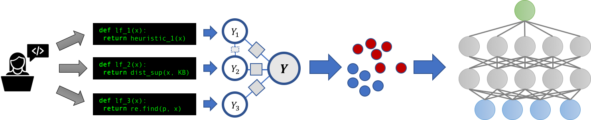

# ANNOUNCEMENT:
**Snorkel v0.9 is being released this summer** and we are absolutely certain you're going to love the new version!

Why is it 0.9 when the last version was 0.7? Because this is more than just an incremental change. It's a total rewrite from the ground up with portability, scalability, and extensibility in mind, including full unit test coverage, type checking, upgraded docstrings, and a fresh batch of tutorials demonstrating different use cases and integrations! The new version will be available via `pip` and `conda` but **will not be backwards compatible**. The current (v0.7) Snorkel code will be moved to another repository to continue to support existing applications that depend on it.

As part of this refactor, we will be bringing under one roof a number of projects in the Snorkel ecosystem that have previously been posted in separate repositories—[Snorkel](https://github.com/HazyResearch/snorkel), [Snorkel MeTaL](https://github.com/HazyResearch/metal), [TANDA](https://github.com/HazyResearch/tanda), etc.—and which have been used to achieve state-of-the-art results on the [GLUE](https://dawn.cs.stanford.edu/2019/03/22/glue/) and [SuperGLUE](https://hazyresearch.github.io/snorkel/blog/superglue.html) benchmarks, automate [cardiac MRI classification](https://www.biorxiv.org/content/10.1101/339630v1) and [genetic research database curation](https://ai.stanford.edu/~kuleshov/papers/gwaskb-manuscript.pdf) (as featured in two forthcoming Nature papers), and extract information from electronic health record (EHR) data for national [medical device surveillance](https://arxiv.org/abs/1904.07640).

If you'd like to stay in the loop on the latest news in the Snorkel ecosystem, join the [Snorkel Google Group](https://groups.google.com/forum/#!forum/snorkel-ml). We'll keep you posted!

---

**_v0.7.0_**

[](https://travis-ci.org/HazyResearch/snorkel)
[](http://snorkel.readthedocs.io/en/master/)
[](https://opensource.org/licenses/Apache-2.0)

## Getting Started

* For the latest news, blog posts, tutorials, papers, etc. related to Snorkel, check out **[snorkel.stanford.edu](http://snorkel.stanford.edu)**!
* Get [set up](#quick-start) quickly
* Try the [tutorials](#tutorials) 
* Read the [documentation](http://snorkel.readthedocs.io/en/master/)


## Motivation

Snorkel is a system for rapidly **creating, modeling, and managing training data.**
Today's state-of-the-art machine learning models require _massive_ labeled training sets--which usually do not exist for real-world applications. Instead, Snorkel is based around the new [data programming](https://papers.nips.cc/paper/6523-data-programming-creating-large-training-sets-quickly) paradigm, in which the developer focuses on writing a set of labeling functions, which are just scripts that programmatically label data. 
The resulting labels are noisy, but Snorkel automatically models this process—learning, essentially, which labeling functions are more accurate than others—and then uses this to train an end model (for example, a deep neural network in TensorFlow).



By modeling a noisy training set creation process in this way, we can take potentially low-quality labeling functions from the user, and use these to train high-quality end models.
We see Snorkel as providing a general framework for many [_weak supervision_](http://hazyresearch.github.io/snorkel/blog/weak_supervision.html) techniques, and as defining a new programming model for weakly-supervised machine learning systems.

**Check out a new [blog post](https://ai.googleblog.com/2019/03/harnessing-organizational-knowledge-for.html) and accompanying [SIGMOD paper](https://arxiv.org/abs/1812.00417) on Snorkel's usage at Google and some thoughts about applying weak supervision at industrial scale!**

Read a recent one-pager about [Snorkel and the Software 2.0 vision](https://cs.stanford.edu/~chrismre/papers/Chris_Re-KDD.pdf)!

For an alternative implementation of data programming with improved scalability and support for multi-task supervision, check out [Snorkel MeTaL](https://github.com/HazyResearch/metal).

## Users \& Sponsors
We're lucky to have some amazing collaborators who are currently using Snorkel!


However, **_Snorkel is very much a work in progress_**, so we're eager for any and all feedback... let us know what you think and how we can improve Snorkel in the [Issues](https://github.com/HazyResearch/snorkel/issues) section!

## References

### Best References:
* **_[Snorkel: Rapid Training Data Creation with Weak Supervision](https://arxiv.org/abs/1711.10160)_ (VLDB 2018)**
* **_[Data Programming: Creating Large Training Sets, Quickly](https://papers.nips.cc/paper/6523-data-programming-creating-large-training-sets-quickly)_ (NeurIPS 2016)**
* **_[Learning the Structure of Generative Models without Labeled Data](https://arxiv.org/abs/1703.00854)_ (ICML 2017)**
* **_[Training Complex Models with Multi-Task Weak Supervision](https://arxiv.org/abs/1810.02840)_ (AAAI 2019)**
* **_[The Role of Massively Multi-Task and Weak Supervision in Software 2.0](https://ajratner.github.io/assets/papers/software_2_mmt_vision.pdf)_ (CIDR 2019)**
* _[Snorkel: Fast Training Set Generation for Information Extraction](http://hazyresearch.github.io/snorkel/pdfs/snorkel_demo.pdf)_ (SIGMOD DEMO 2017)
* _[Inferring Generative Model Structure with Static Analysis](https://arxiv.org/abs/1709.02477)_ (NeurIPS 2017)
* _[Data Programming with DDLite: Putting Humans in a Different Part of the Loop](http://cs.stanford.edu/people/chrismre/papers/DDL_HILDA_2016.pdf)_ (HILDA @ SIGMOD 2016; note Snorkel was previously <em>DDLite</em>)
* _[Socratic Learning: Correcting Misspecified Generative Models using Discriminative Models](https://arxiv.org/abs/1610.08123)_
* _[Fonduer: Knowledge Base Construction from Richly Formatted Data](https://arxiv.org/abs/1703.05028)_ (SIGMOD 2018)

### Further Reading:
* _[Learning to Compose Domain-Specific Transformations for Data Augmentation](https://arxiv.org/abs/1709.01643)_ (NeurIPS 2017)
* _[Gaussian Quadrature for Kernel Features](https://arxiv.org/abs/1709.02605)_ (NeurIPS 2017)

## Quick Start

This section has the commands to quickly get started running Snorkel.
For more detailed installation instructions, see the [Installation section](#installation) below.
These instructions assume that you already have [conda](https://conda.io/) installed.

First, download and extract a copy of the Snorkel directory from a [GitHub release](https://github.com/HazyResearch/snorkel/releases) (version 0.7.0 or greater).
Then navigate to the root of the `snorkel` directory in a terminal and run the following:

```sh
# Install the environment
conda env create --file=environment.yml

# Activate the environment
source activate snorkel

# Install snorkel in the environment
pip install .

# Optionally: You may need to explicitly set the Jupyter Notebook kernel
python -m ipykernel install --user --name snorkel --display-name "Python (snorkel)"

# Activate jupyter widgets
jupyter nbextension enable --py widgetsnbextension

# Initiate a jupyter notebook server
jupyter notebook
```

Then a Jupyter notebook tab will open in your browser. From here you can run existing Snorkel notebooks or create your own.

### Tutorials

From within the Jupyter browser, navigate to the [`tutorials`](tutorials) directory and try out one of the existing notebooks!

The [introductory tutorial](tutorials/intro) in `tutorials/intro` covers the entire Snorkel workflow, showing how to extract spouse relations from news articles.
You can also check out all the great [materials](https://simtk.org/frs/?group_id=1263) from the recent Mobilize Center-hosted [Snorkel workshop](http://mobilize.stanford.edu/events/snorkelworkshop2017/)!

## Release Notes

### Major changes in v0.7:
* [PyTorch](https://pytorch.org/) classifiers
* Installation now via [Conda](https://conda.io/) and `pip`
* Now [spaCy](https://spacy.io/) is the default parser (v1), with support for v2
* And many more fixes, additions, and new material!

### Older versions

<details>

### Major changes in v0.6:

* Support for categorical classification, including "dynamically-scoped" or _blocked_ categoricals (see [tutorial](tutorials/advanced/Categorical_Classes.ipynb))
* Support for structure learning (see [tutorial](tutorials/advanced/Structure_Learning.ipynb), ICML 2017 paper)
* Support for labeled data in generative model
* Refactor of TensorFlow bindings; fixes grid search and model saving / reloading issues (see `snorkel/learning`)
* New, simplified Intro tutorial ([here](tutorials/intro))
* Refactored parser class and support for [spaCy](https://spacy.io/) as new parser
* Support for easy use of the [BRAT annotation tool](http://brat.nlplab.org/) (see [tutorial](tutorials/advanced/BRAT_Annotations.ipynb))
* Initial Spark integration, for scale out of LF application (see [tutorial](tutorials/snark/Snark%20Tutorial.ipynb))
* Tutorial on using crowdsourced data [here](tutorials/crowdsourcing/Crowdsourced_Sentiment_Analysis.ipynb)
* Integration with [Apache Tika](http://tika.apache.org/) via the [Tika Python](http://github.com/chrismattmann/tika-python.git) binding.
* And many more fixes, additions, and new material!

</details>

## Installation

Starting with version 0.7.0, Snorkel should be installed as a Python package using `pip`.
However, installing Snorkel via `pip` will not install dependencies, which are required for Snorkel to run.
To manage its dependencies, Snorkel uses [conda](https://conda.io/), which allows specifying an environment via an `environment.yml` file.

This documentation covers two common cases (usage and development) for setting up conda environments for Snorkel.
In both cases, the environment can be activated using `conda activate snorkel` and deactivated using `conda deactivate`
(for versions of conda prior to 4.4, replace `conda` with `source` in these commands).
Users just looking to try out a Snorkel tutorial notebook should see the quick-start instructions above.

### Using Snorkel as a Package

This setup is intended for users who would like to use Snorkel in their own applications by importing the package.
In such cases, users should define a custom `environment.yml` to manage their project's dependencies.
We recommend starting with the [`environment.yml`](environment.yml) in this repository.
The below modifications can help customize it for your needs:

<details>

1. Specifying versions for the listed packages, such as changing `python` to `python=3.6.5`.
Versioned specification of your environment is critical to reproducibility and ensuring dependency updates do not break your pipeline.
When first setting your package versions, you likely want to start with the latest versions available on the [conda-forge](https://anaconda.org/conda-forge/) channel, unless you have a reason to do otherwise.
2. Adding other packages to your environment as required by your use case.
Consider maintaining alphabetical sorting of packages in `environment.yml` to assist with maintainability.
In addition, we recommend installing packages via pip, only if they are not available in the conda-forge channel.
3. Add the `snorkel` package installation to your `environment.yml`, under the `- pip` section.
Of course, we suggest versioning snorkel, which you can do via a release number or commit hash (to access more bleeding edge functionality)
  ```yml
    # Versioned via release tag
    - git+https://github.com/HazyResearch/snorkel@v0.6.3
    # Versioned via commit hash (commit hash below is fake to ensure you change it)
    - git+https://github.com/HazyResearch/snorkel@7eb7076f70078c06bef9752f22acf92fd86e616a
  ```
Finally, consider versioning the `numbskull` and `treedlib` pip dependencies by changing `master` to their latest commit hash on GitHub.

</details>

### Development Environment

This setup is intended for users who have cloned this repository and would like to access the environment for development.
This approach installs the `snorkel` package in development mode, meaning that changes you make to the source code will automatically be applied to the `snorkel` package in the environment.

```sh
# From the root direcectory of this repo run the following command.
conda env create --file=environment.yml

# Activate the conda environment (if using a version of conda below 4.4, use "source" instead of "conda")
conda activate snorkel

# Install snorkel in development mode
pip install --editable .
```

### Additional installation notes

<details>

Snorkel can be installed directly from its GitHub repository via:

```
# WARNING: read installation section before running this command! This command
# does not install any dependencies. It installs the latest master version but
# you can change master to tag or commit
pip install git+https://github.com/HazyResearch/snorkel@master
```

_Note: Currently the `Viewer` is supported on the following versions:_
* `jupyter`: 4.1
* `jupyter notebook`: 4.2

</details>

## Q & A
**Many questions about Snorkel get answered in the issues section--along with general discussions and conversations of interest.
We tag these all as "Q&A" and save them [here](https://github.com/HazyResearch/snorkel/issues?utf8=%E2%9C%93&q=is%3Aissue+label%3A%22Q%26A%22+)**

## Issues
We like [issues](https://github.com/HazyResearch/snorkel/issues) as a place to put bugs, questions, feature requests, etc- don't be shy!
If submitting an issue about a bug, however, **please provide a pointer to a notebook (and relevant data) to reproduce it.**

*Note: if you have an issue with the matplotlib install related to the module `freetype`, see [this post](http://stackoverflow.com/questions/20533426/ubuntu-running-pip-install-gives-error-the-following-required-packages-can-no); if you have an issue installing ipython, try [upgrading setuptools](http://stackoverflow.com/questions/35943606/error-on-installing-ipython-for-python-3-sys-platform-darwin-and-platform)*

## Jupyter Notebook Best Practices

Snorkel is built specifically with usage in **Jupyter/IPython notebooks** in mind; an incomplete set of best practices for the notebooks:

<details>

It's usually most convenient to write most code in an external `.py` file, and load as a module that's automatically reloaded; use:
```python
%load_ext autoreload
%autoreload 2
```
A more convenient option is to add these lines to your IPython config file, in `~/.ipython/profile_default/ipython_config.py`:
```
c.InteractiveShellApp.extensions = ['autoreload']     
c.InteractiveShellApp.exec_lines = ['%autoreload 2']
```

</details>

## Acknowledgements
    

*Sponsored in part by DARPA as part of the [D3M](https://www.darpa.mil/program/data-driven-discovery-of-models) program under contract No. FA8750-17-2-0095 and the [SIMPLEX](http://www.darpa.mil/program/simplifying-complexity-in-scientific-discovery) program under contract number N66001-15-C-4043, and also by the NIH through the [Mobilize Center](http://mobilize.stanford.edu/) under grant number U54EB020405.*
